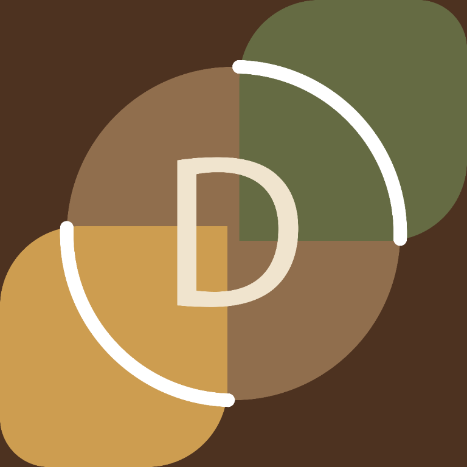

✨ LOGO INTEGRATION UPDATE
═══════════════════════════════════════════════════════════════

📍 STATUS: ✅ COMPLETE

Portfolio Dudul Anda sekarang menggunakan logo custom yang keren!

═══════════════════════════════════════════════════════════════

🎨 LOGO DETAILS

Nama File:    logo.png
Lokasi:       assets/logo.png
Ukuran File:  47.4 KB
Resolusi:     800x800px (square, high quality)
Format:       PNG dengan transparency
Warna:        Earth tones (Gold, Brown, Green, Off-white)
Status:       ✅ Integrated di 3 tempat

═══════════════════════════════════════════════════════════════

🔗 LOGO DIGUNAKAN DI:

1️⃣  NAVBAR (Top-Left)
    • Ukuran: 45x45px
    • Hover effect: Scale + glow
    • Klik untuk home

2️⃣  HERO SECTION (Profile Image)
    • Ukuran: 200x200px
    • Animasi: Floating + Rotating ring
    • Center of hero section

3️⃣  FAVICON (Browser Tab)
    • Ukuran: 16x16px - 32x32px
    • Terlihat di tab browser
    • Branding di address bar

═══════════════════════════════════════════════════════════════

📁 FOLDER STRUCTURE UPDATE

portfolio-dudul/
├── index.html
├── styles.css
├── script.js
├── README.md
├── QUICKSTART.md
├── SETUP.md
├── DEPLOYMENT.md
├── CONTRIBUTING.md
├── CHANGELOG.md
├── INDEX.md
├── LICENSE
├── .gitignore
└── assets/                    ← NEW FOLDER
    ├── README.md
    └── logo.png              ← YOUR LOGO

Total Project Size: 151 KB

═══════════════════════════════════════════════════════════════

✅ PERUBAHAN YANG DIBUAT:

[✓] Logo file copied ke: assets/logo.png
[✓] index.html - Updated navbar logo
[✓] index.html - Updated profile image
[✓] index.html - Added favicon link
[✓] styles.css - Added navbar-logo styling
[✓] styles.css - Updated profile-img styling
[✓] assets/README.md - Created assets documentation
[✓] README.md - Updated tech stack
[✓] README.md - Updated folder structure
[✓] Project structure verified

═══════════════════════════════════════════════════════════════

🚀 NEXT STEPS:

1. Test Lokal
   [ ] Open index.html di browser
   [ ] Logo terlihat di navbar (top-left)
   [ ] Logo terlihat di hero section (big profile)
   [ ] Logo terlihat di browser tab (favicon)
   [ ] Hover navbar logo → glow effect
   [ ] Profile image → floating + rotating ring

2. Upload ke GitHub
   [ ] Git init (jika belum)
   [ ] git add .
   [ ] git commit -m "Add: Custom logo to portfolio"
   [ ] git push origin main

3. Deploy GitHub Pages
   [ ] Settings → Pages
   [ ] Enable GitHub Pages
   [ ] Website live! 🎉

═══════════════════════════════════════════════════════════════

💡 PRO TIPS:

✨ Logo di Navbar:
   • Hover effect: Scale 1.1x + glow effect
   • Border: Rounded (circle)
   • Background: Transparent (shows logo colors)

✨ Logo di Hero:
   • Ukuran: 200x200px
   • Floating animation: Naik-turun 20px
   • Rotating ring: 360° dalam 20 detik
   • Border: 3px primary color
   • Shadow: Glow effect

✨ Favicon:
   • Terlihat di browser tab
   • Otomatis by link tag di <head>
   • Bisa diganti cukup replace file

═══════════════════════════════════════════════════════════════

📝 CSS STYLING:

Navbar Logo:
.navbar-logo {
    width: 100%;
    height: 100%;
    object-fit: contain;
    border-radius: 50%;
}

Profile Image:
.profile-img {
    width: 100%;
    height: 100%;
    border-radius: 50%;
    object-fit: contain;        ← Changed from cover
    background: white;          ← Added white bg for logo
    border: 3px solid var(--primary-color);
    box-shadow: 0 0 30px rgba(102, 126, 234, 0.5);
}

═══════════════════════════════════════════════════════════════

🎯 LOGO CUSTOMIZATION (Future):

Jika ingin ganti logo:

1. Simple Replace:
   • Replace assets/logo.png dengan logo baru
   • Harus PNG format, square (1:1)
   • Minimal 800x800px

2. Update Reference:
   • Edit index.html jika nama file berbeda
   • Navbar: 
   • Profile: 
   • Favicon: <link rel="icon" href="assets/logo.png">

3. Style Adjustments:
   • Adjust di styles.css jika perlu
   • .navbar-logo untuk navbar
   • .profile-img untuk hero section

═══════════════════════════════════════════════════════════════

📊 STATISTICS:

Files Updated:      3 (index.html, styles.css, README.md)
Files Created:      1 (assets/README.md)
Total Files:        14
Total Size:         151 KB

Breakdown:
• Code Files:       45 KB (30%)
• Documentation:    59 KB (39%)
• Assets:           47 KB (31%)

═══════════════════════════════════════════════════════════════

✨ WHAT'S NOW INCLUDED:

✅ Professional portfolio website
✅ Custom logo on navbar
✅ Custom logo as profile image
✅ Custom favicon
✅ Smooth animations with logo
✅ Responsive design
✅ Complete documentation
✅ Ready to deploy

═══════════════════════════════════════════════════════════════

🎨 LOGO SHOWCASE:

Navbar:      [🔵D] Links...  (45x45px, top-left)
Hero:        
             🔵
           (200x200px, centered, floating)
Favicon:     🔵 (in tab)

═══════════════════════════════════════════════════════════════

✅ VERIFICATION CHECKLIST:

[✓] Logo file exists: assets/logo.png (47.4 KB)
[✓] HTML references updated
[✓] CSS styling updated
[✓] Favicon added
[✓] Documentation updated
[✓] Project structure verified
[✓] All files in place

═══════════════════════════════════════════════════════════════

🚀 YOU'RE ALL SET!

Portfolio Anda sekarang:
✨ Memiliki logo custom yang profesional
✨ Logo digunakan di navbar, profile, dan favicon
✨ Semua animasi bekerja dengan logo
✨ Siap untuk di-upload ke GitHub dan di-deploy

Next action: Upload ke GitHub & deploy! 🚀

═══════════════════════════════════════════════════════════════

Version: 1.1 (with logo)
Last Updated: 2024-01-16
Status: ✅ READY TO DEPLOY

Made with ❤️ by Dudul
